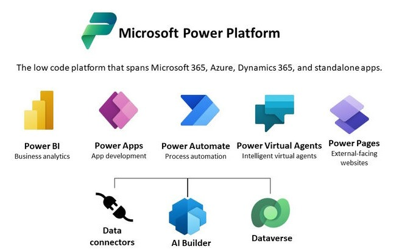

# Microsoft Power Platform 

Empower your team to build apps, automate workflows, analyze data, and create virtual agents—all without writing a single line of code. Our Power Platform training site offers hands-on tutorials, expert guidance, and real-world use cases to help you master Power Apps, Power Automate, Power BI, and Power Virtual Agents. Whether you're a beginner or looking to deepen your skills, start your low-code journey here.
  

Use the SharePoint Success Site to:

- **Learn Power Automate** - Discover how to streamline tasks and boost productivity with Microsoft Power Automate. This training guides you through building automated workflows across apps and services—no coding required. Perfect for beginners and professionals looking to simplify processes and save time.

- **Learn Power Apps** - Build custom business apps with ease using Microsoft Power Apps. This training helps you design intuitive, low-code applications that connect to your data and streamline your workflows—no development experience needed.

- **Learn Power BI** - Turn data into insights with Microsoft Power BI. This training helps you create interactive dashboards, visualize trends, and make data-driven decisions—perfect for anyone looking to unlock the power of analytics with ease.

This customizable, communication site streams on-demand content curated by Microsoft right to end users through the [Microsoft 365 learning pathways solution](https://docs.microsoft.com/en-us/office365/customlearning/). M365 learning pathways allows you to hide and show Microsoft maintained content as well as upload your own custom playlists for training purposes.

## Prerequisites

The person doing the provisioning must meet the following pre-requisites:

- Must be a tenant administrator of the tenant - also known as the Office 365 global administrator role - where the Power Platform Training will be provisioned.
- The person provisioning the Power Platform Training must be a site collection owner of the App Catalog. If the person provisioning the SharePoint Success Site is not a site collection owner of the App Catalog [complete these instructions to continue](https://docs.microsoft.com/office365/customlearning/addappadmin).

The tenant must meet the following provisioning pre-requisites:

- A SharePoint App Catalog must be available within your tenant environment. If your organization does not have a SharePoint App catalog, refer to the [SharePoint Online documentation](https://docs.microsoft.com/sharepoint/use-app-catalog) to create one.
- Your tenant must have version 4.0 or higher of M365 learning pathways. If you need to [upgrade your version](https://docs.microsoft.com/office365/customlearning/custom_update) or determine what version of M365 learning pathways you have review the documentation. If you need to install M365 learning pathways go to the [M365LP solution page](https://docs.microsoft.com/office365/customlearning/custom_provision) and review documentation for set up and configuration.

## What will be provisioned?

This template contains following elements which will be provisioned:

- A communication site containing the SharePoint Success Site content (e.g., pages)

## Privacy Policy

Microsoft collects active usage data from your organization’s use of Microsoft 365 earning pathways and the use of Microsoft’s online content. Microsoft uses this data to help improve future Microsoft 365 learning pathways solutions. To learn more about Microsoft privacy policies see https://go.microsoft.com/fwlink/?LinkId=521839. If you would like to opt out of this data collection, please execute the script TelemetryOptOut.ps1 from the solution Github repository once the installation is complete.

## Disclaimer

THIS CODE IS PROVIDED AS IS WITHOUT WARRANTY OF ANY KIND, EITHER EXPRESS OR IMPLIED, INCLUDING ANY IMPLIED WARRANTIES OF FITNESS FOR A PARTICULAR PURPOSE, MERCHANTABILITY, OR NON-INFRINGEMENT.
